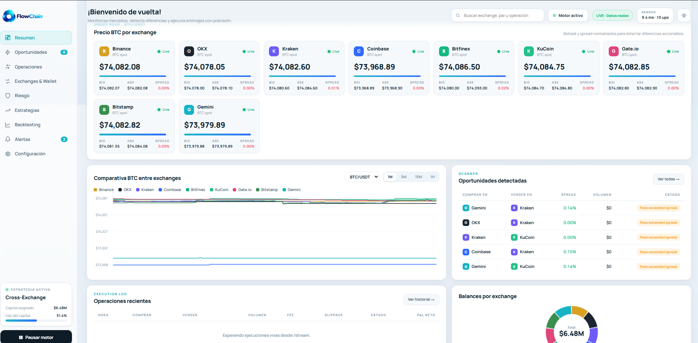
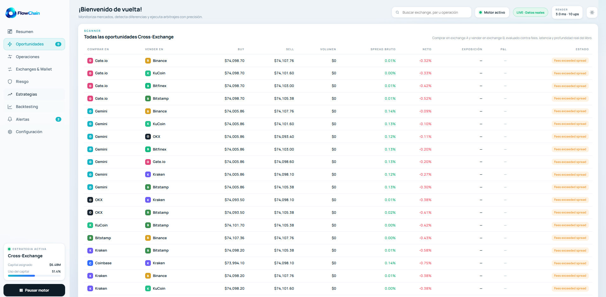
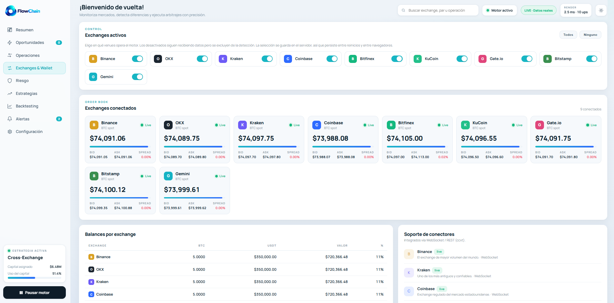
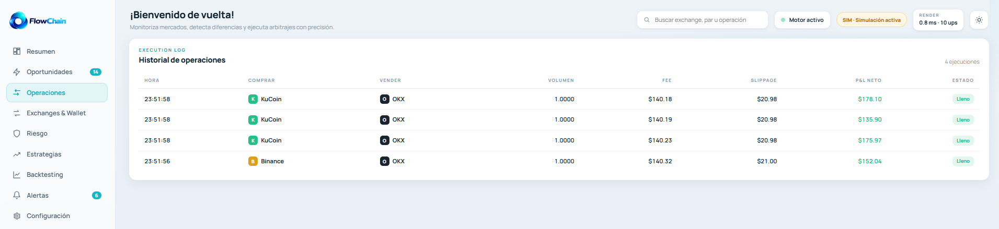
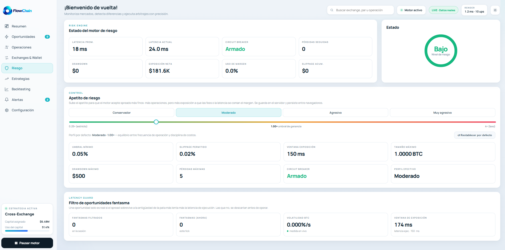
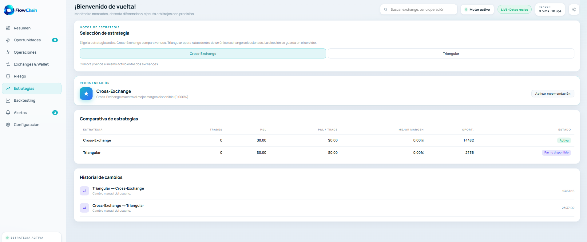

<div align="center">

# FlowChain — Bot de Arbitraje de Bitcoin en Tiempo Real

**Detección, evaluación y ejecución simulada de oportunidades de arbitraje de BTC entre 9 exchanges, con feeds nativos por WebSocket, modelo de rentabilidad neta honesto, gestión de riesgo con circuit breaker y un dashboard web en vivo.**


**Demo en vivo:** [http://87.99.133.208:8080/](http://87.99.133.208:8080/)  ·  **Repositorio:** [github.com/said7628/CCM](https://github.com/said7628/CCM)

</div>



---

## Tabla de contenidos

- [Descripción](#descripción)
- [Características principales](#características-principales)
- [Stack tecnológico](#stack-tecnológico)
- [Cómo funciona](#cómo-funciona-el-pipeline-de-decisión)
- [Arquitectura](#arquitectura)
- [Instalación y uso](#instalación-y-uso)
- [Despliegue en producción](#despliegue-en-producción-pm2)
- [Variables de entorno](#variables-de-entorno)
- [Capturas de pantalla](#capturas-de-pantalla)
- [Roadmap](#roadmap)
- [Disclaimer](#disclaimer)

---

## Descripción

Bitcoin se negocia simultáneamente en cientos de exchanges, cada uno con su propia
liquidez y libro de órdenes. Como ningún mercado es perfectamente eficiente, los
precios **nunca son idénticos** entre plataformas: aparecen y desaparecen
divergencias de precio en cuestión de milisegundos. Cuando el precio de **compra
(Ask)** de un exchange es menor que el precio de **venta (Bid)** de otro, existe
una oportunidad de arbitraje.

**FlowChain** es un sistema de trading automático que:

1. **Monitorea en tiempo real** los order books de BTC/USDT en hasta **9 exchanges** mediante WebSockets nativos.
2. **Detecta** las divergencias en el instante en que ocurren y las **prioriza por rentabilidad neta**.
3. **Evalúa** cada oportunidad de forma honesta: descuenta fees de cada exchange, slippage, costo de latencia y la profundidad real del order book.
4. **Simula la ejecución** de la compra y la venta simultánea, gestionando **órdenes parciales** y los **balances de cada wallet**.
5. **Protege el capital** con un circuit breaker y un filtro de "oportunidades fantasma" que descarta edges que la latencia se comería.
6. **Visualiza todo** en un dashboard web en vivo: order books, oportunidades, ejecuciones, desglose de costos y P&L acumulado.

> La diferencia entre un bot promedio y uno excepcional no está solo en detectar
> oportunidades, sino en **priorizarlas, evaluarlas con honestidad y gestionar el
> riesgo** cuando el mercado se mueve en contra durante la ejecución. FlowChain se
> diseñó alrededor de esa idea.

---

## Características principales

| Característica | Detalle |
|---|---|
| **Feeds 100% WebSocket** | 9 exchanges (Binance, Kraken, OKX, Coinbase, Bitfinex, KuCoin, Gate.io, Bitstamp, Gemini) con conector nativo. Cero polling REST en el modo live. |
| **Rentabilidad neta real** | No usa el spread bruto: recorre ambos libros *slice por slice* (VWAP) acumulando volumen **solo mientras cada porción marginal cubre las fees**. Resultado: el tamaño óptimo de la operación y un P&L honesto. |
| **Filtro de oportunidades fantasma** | Estima la volatilidad de BTC en vivo (EWMA) y rechaza edges que no sobrevivirían a la *ventana de exposición* (antigüedad de la pata más lenta + latencia de ejecución), escalando con la raíz del tiempo. |
| **Gestión de riesgo** | Circuit breaker por pérdidas consecutivas o drawdown máximo, con cooldown automático. Selector de **apetito de riesgo** (Conservador a Muy agresivo) que reajusta umbrales en caliente. |
| **Wallets y órdenes parciales** | Balances por exchange que se actualizan tras cada operación; si la liquidez o el balance no cubren el volumen, ejecuta un *fill parcial* balanceado. |
| **Dos estrategias** | **Cross-Exchange** (comparar venues) y **Arbitraje Triangular** (rutas dentro de un mismo exchange, p. ej. BTC a ETH a USDT a BTC). |
| **Dashboard en vivo (SSE)** | Server-Sent Events sin dependencias extra: order books con barras de profundidad, feed de oportunidades (ejecutadas vs rechazadas con su razón), log de ejecución, desglose de costos y gráfica de P&L. |
| **Feeds observables** | Watchdog de frescura que **reconecta** automáticamente cualquier feed que se quede mudo, y badges honestos que muestran "Live" o "hace Xs" según la edad real del dato. |
| **Persistencia** | Preferencias (exchanges activos, apetito de riesgo, estrategia) e historial de P&L persisten en disco y se comparten entre navegadores y reinicios. |
| **Arquitectura intercambiable** | El motor es **puro** (sin I/O): el mismo código corre contra el simulador determinista o contra los feeds reales sin tocar una línea. |

---

## Stack tecnológico

| Capa | Tecnología | Por qué |
|------|------------|---------|
| **Lenguaje** | TypeScript 5.6 (estricto) | Tipado del dominio financiero (OrderBook, Opportunity, Trade) que evita errores caros. |
| **Runtime** | Node.js >= 20 | Un único proceso, event-loop ideal para I/O de WebSockets concurrentes. |
| **Servidor web** | `http` nativo + **Server-Sent Events** | Streaming en tiempo real **sin framework ni dependencias** de servidor. |
| **Feeds en vivo** | [`ws`](https://github.com/websockets/ws) | 9 conectores WebSocket nativos con order book local incremental. |
| **Fallback de datos** | [`ccxt`](https://github.com/ccxt/ccxt) | Polling REST opcional como último recurso (`SOURCE=live-rest`). |
| **Frontend** | HTML + CSS + JS *vanilla* (un solo archivo) | Sin build, sin framework, sin `localStorage`. Estética terminal/fintech, responsive. |
| **Ejecución TS** | `ts-node --transpile-only` | Arranque rápido sin paso de compilación. |
| **Tests** | Runner propio en TS (~93 pruebas) | Cubre motor, order books, validación de secuencia, conectores y latency-risk. |
| **Proceso / Deploy** | **PM2** (`ecosystem.config.js`) | Reinicios automáticos, logs y persistencia entre reinicios del servidor. |
| **Persistencia** | Archivos JSON atómicos (`fs`) | Sin base de datos: simple, portable y suficiente para el caso de uso. |

---

## Cómo funciona (el pipeline de decisión)

Cada `tick()` es **un ciclo de decisión completo**:

```
 books (9 venues) --> detector --> profitability --> risk gate --> executor --> wallets/P&L
                        |              |                |             |
                   rankea por     sizing óptimo     circuit       fills parciales
                   net profit     + net honesto     breaker       balanceados
```

1. **Detección.** Se evalúan *todas* las parejas dirigidas (comprar en X, vender en Y) en ambos sentidos y se **rankean por ganancia neta** — no se toma la primera que aparece.
2. **Rentabilidad neta.** Para cada pareja se recorren los libros acumulando volumen mientras cada porción marginal siga siendo positiva *después de fees*. Eso da el **tamaño que maximiza la ganancia** y un net P&L que incluye fees taker de cada exchange, slippage, costo de latencia y (opcional) costo de retiro.
3. **Filtro de fantasmas (latency-risk).** El edge solo es real si sobrevive a la ventana de exposición. Se modela el movimiento adverso esperado (`z · volatilidad · raíz(exposición)`) y se rechaza lo que no sobreviva. Aparecen como `latency_risk` en el scanner.
4. **Riesgo.** Si hay demasiadas pérdidas consecutivas o el drawdown supera el límite, el circuit breaker **detiene la operación** y entra en cooldown.
5. **Ejecución simulada.** Se "compra" en el venue barato y se "vende" en el caro al mismo tamaño, recortado por la liquidez del libro **y** por lo que las wallets pueden fondear, generando un *fill parcial* si hace falta.
6. **Registro.** Se actualizan balances, P&L acumulado y el historial, y se emite un snapshot al dashboard por SSE.




---

## Arquitectura

La decisión rectora es una **separación dura entre un motor puro y sus consumidores**.
El motor no tiene I/O ni dependencias externas, así que es 100% testeable y se comporta
igual lo conduzca la consola, la web, el simulador o los exchanges reales.

```
            +---------------------------------------------+
            |                 MOTOR (puro)                |
 books ---> |  detector -> profitability -> executor      | ---> TickResult
            |      ^            ^             ^            |     (opps, trade,
            |  orderbook     config      wallet · risk     |      P&L, riesgo)
            +---------------------------------------------+
                 ^                                   |
   MarketDataSource (interfaz)            consumidores: CLI · Web (SSE)
   |-- SimulatedSource  (determinista, sin red)
   |-- WebSocketSource  (9 venues, push, baja latencia)  <-- modo LIVE
   +-- LiveSource (ccxt) (polling REST, fallback)
```

### Módulos clave

| Archivo | Responsabilidad |
|---------|-----------------|
| `domain/types.ts` | Estructuras del dominio (OrderBook, Opportunity, Trade, Wallet). |
| `domain/config.ts` | Fees por exchange + parámetros de trading/riesgo (overridables por env). |
| `engine/orderbook.ts` | Recorre el libro para un **VWAP real** en vez de confiar en el top-of-book. |
| `engine/profitability.ts` | **Sizing que maximiza la ganancia** + net P&L honesto. |
| `engine/detector.ts` | Escanea todas las parejas en ambos sentidos y **rankea por net profit**. |
| `engine/executor.ts` | Ejecución simulada con **fills parciales recortados por balance**. |
| `engine/wallet.ts` | Balances por exchange, aplicación de trades, P&L mark-to-market. |
| `engine/risk.ts` | **Circuit breaker** por pérdidas/drawdown + cooldown. |
| `engine/engine.ts` | Orquesta el ciclo completo por cada `tick()` + apetito de riesgo. |
| `engine/strategies.ts` | Lógica de selección/recomendación de estrategia. |
| `exchanges/source.ts` | Interfaz `MarketDataSource` + simulador determinista. |
| `exchanges/ws-source.ts` | Fuente event-driven por WebSocket (WS-only) + **watchdog de frescura**. |
| `exchanges/localbook.ts` | Order book local incremental + CRC32 (integridad). |
| `exchanges/binance-sync.ts` | Validación de secuencia del diff-stream de Binance (resync ante gaps). |
| `exchanges/*-ws.ts` | 9 conectores WebSocket nativos (Binance, Kraken, OKX, Coinbase, Bitfinex, KuCoin, Gate.io, Bitstamp, Gemini). |
| `exchanges/triangular.ts` · `tri-source.ts` | Arbitraje triangular dentro de un mismo venue. |
| `exchanges/live.ts` | Fuente REST por ccxt (fallback). |
| `cli/main.ts` | Dashboard de consola consumiendo el motor. |
| `server/index.ts` | Servidor HTTP + SSE: corre el motor y transmite el estado al navegador. |
| `server/public/index.html` | Dashboard web en vivo. |

---

## Instalación y uso

### Requisitos
- **Node.js >= 20** (probado en 22).

### Instalación

```bash
git clone https://github.com/said7628/CCM.git
cd CCM
npm install        
```

### Modo demo (simulador determinista, sin red) — recomendado para presentar

```bash
npm run server     
```

El simulador genera divergencias controladas que **cruzan el umbral de costos**,
de modo que el bot opera de forma activa y a la vez **rechaza** los edges malos
(para que se vea la disciplina de costos). Ideal para una demo reproducible.

### Modo en vivo (WebSockets reales de los 9 exchanges)

```bash
SOURCE=live npm run server
# o eligiendo venues:
EXCHANGES=binance,okx,kraken,coinbase,bitfinex,kucoin,gate,bitstamp,gemini SOURCE=live npm run server
```

> También puedes cambiar entre **LIVE / SIM** desde el propio dashboard (el toggle
> "Fuente de datos"); la elección se guarda en el servidor.

### Dashboard de consola

```bash
npm run cli                  
SOURCE=sim-stream npm run cli 
SOURCE=live npm run cli      
```

### Tests

```bash
npm test                      
npm run typecheck           
```

---

## Despliegue en producción (PM2)

El sistema completo es **un solo proceso Node**, perfecto para un VPS pequeño.
Incluye un `ecosystem.config.js` listo:

```bash
npm install
npm install -g pm2
mkdir -p logs data

pm2 start ecosystem.config.js   
pm2 status                      
pm2 logs arbi-bot               
pm2 save && pm2 startup        
```

> Corre **una sola instancia en modo `fork`** (no cluster): el motor mantiene
> estado en memoria (wallets, trades, clientes SSE) y un único feed de mercado.
> El `ecosystem.config.js` ya está configurado así.

Para una URL limpia con HTTPS, pon **Nginx/Caddy** como reverse proxy hacia el
puerto 8080 (con `proxy_buffering off;` para que el stream SSE no se quede colgado).

---

## Variables de entorno

Todas son opcionales — el sistema arranca con valores por defecto sensatos.

| Variable | Defecto | Descripción |
|----------|---------|-------------|
| `PORT` | `8080` | Puerto del dashboard. |
| `SOURCE` | `sim` | `sim`, `sim-stream`, `live` (WebSocket) o `live-rest` (ccxt). |
| `EXCHANGES` | los 9 | Lista de venues a conectar, separados por coma. |
| `INTERVAL_MS` | `150` | Cadencia del tick del motor (ms). |
| `MIN_NET_PROFIT_PCT` | `0.0005` | Umbral mínimo de ganancia neta (fracción) para ejecutar. |
| `MAX_TRADE_SIZE_BTC` | `1.0` | Tamaño máximo por operación. |
| `SLIPPAGE_BUFFER_PCT` | `0.0002` | Colchón de slippage sobre el notional. |
| `EXECUTION_LATENCY_MS` | `150` | Latencia de ejecución asumida (alimenta el filtro de fantasmas). |
| `VOLATILITY_PCT_PER_SEC` | `0.0006` | Volatilidad fallback hasta medirla en vivo. |
| `LATENCY_RISK_Z` | `2.0` | Cuántos "movimientos esperados" se exigen sobrevivir. |
| `WS_STALE_MS` | `12000` | Umbral para reconectar un feed que se quedó mudo. |
| `BINANCE_WS_BASE` | host `.vision` | Endpoint WS de Binance (sin geobloqueo por defecto). |
| `OKX_WS_BASE` | `ws.okx.com` | Endpoint WS de OKX (usa `wsaws.okx.com` si tu región lo requiere). |
| `SIM_DIVERGENCE_CHANCE` | `0.35` | Probabilidad de inyectar una divergencia por tick (simulador). |
| `SIM_EDGE_MIN_PCT` / `SIM_EDGE_MAX_PCT` | `0.0010` / `0.0045` | Rango de magnitud de las divergencias simuladas. |

---

## Capturas de pantalla


### Exchanges y order books (los 9 venues + wallets)



### Log de ejecución y P&L acumulado



### Motor de riesgo y selector de apetito



### Estrategias: Cross-Exchange y Triangular



> **Convención:** guarda las imágenes en `docs/screenshots/` con los nombres
> indicados arriba y se renderizarán automáticamente en este README.

---

## Roadmap

- [x] Modelo de dominio, VWAP, detección, sizing óptimo y net P&L honesto.
- [x] Ejecución simulada + wallets + fills parciales.
- [x] Riesgo / circuit breaker + selector de apetito con reset a defaults.
- [x] Feeds WebSocket event-driven en 9 venues con libros incrementales, validación de secuencia y CRC32.
- [x] Filtro de oportunidades fantasma con volatilidad en vivo.
- [x] Arbitraje **Cross-Exchange** y **Triangular**.
- [x] Dashboard web por SSE con persistencia entre sesiones.
- [x] Watchdog de frescura + badges de estado honestos.
- [ ] Rebalanceo automático de inventario entre venues.
- [ ] Arbitraje estadístico.
- [ ] Analítica de *time-to-live* de las oportunidades.

---

## Disclaimer

Este proyecto es una **simulación** con fines educativos y de competencia. **No
coloca órdenes reales** ni constituye asesoría financiera. El arbitraje real entre
exchanges después de comisiones es muy competido y a menudo no rentable para
participantes minoristas.